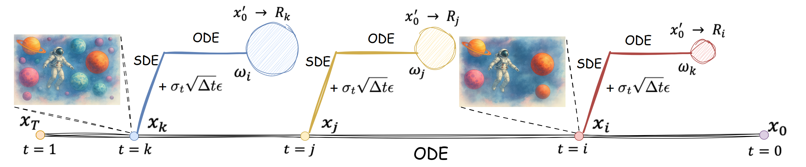
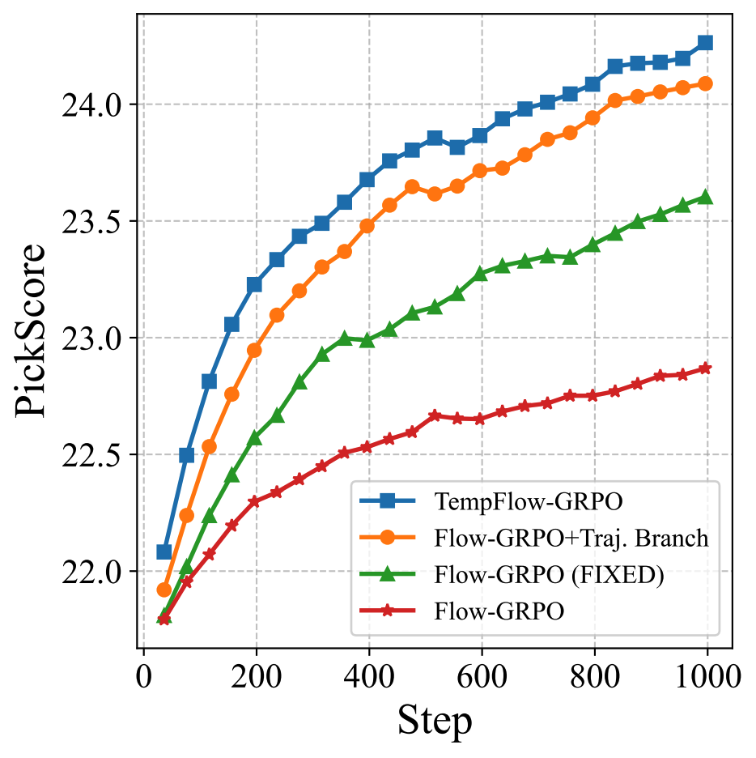
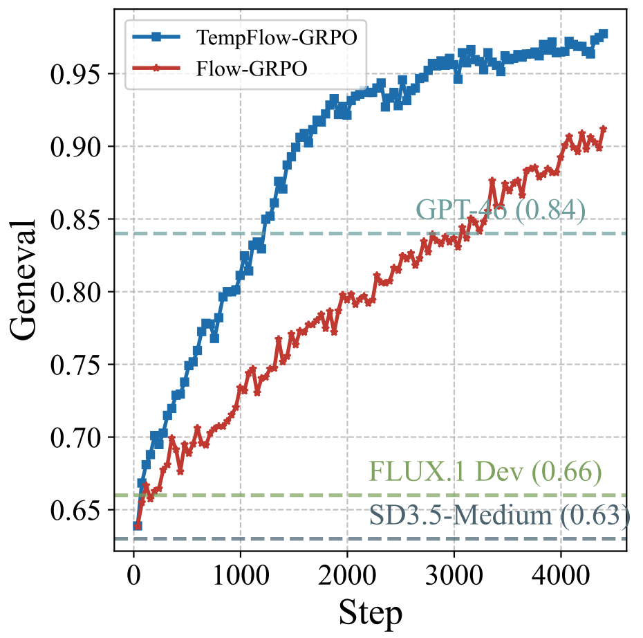

    

<b>🦖 TEMPFLOW-GRPO: WHEN TIMING MATTERS FOR GRPO IN FLOW MODELS </b>

**TempFlow-GRPO** (Temporal Flow GRPO), a principled GRPO framework that captures and exploits the temporal structure inherent in flow-based generation. 

## 🗺️ Roadmap for TempFlow-GRPO
> TempFlow-GRPO (Temporal Flow GRPO), a principled GRPO framework that captures and exploits the temporal structure inherent in flow-based generation. introduces two key innovations: (i) a trajectory branching mechanism that provides process rewards by concentrating stochasticity at designated branching points, enabling precise credit assignment without requiring specialized intermediate reward models and (ii) an noise weighting scheme that modulates policy optimization according to the intrinsic exploration potential of each timestep, prioritizing learning during high-impact early stages while ensuring stable refinement in later phases. These additions endow the model with temporally-aware optimization that respects the underlying generative dynamics, translating into state-of-the-art gains in human preference alignment, and standard text-to-image benchmarks
> 
> Welcome Ideas and Contribution. Stay tuned!

## 🆕 News

> We have presented an improved **Flow-GRPO** method, **TempFlow-GRPO**.🔥🔥🔥
- **[2025-08-06]** We have released the first version of our paper. 🔥🔥🔥

## 📊 Experimental Performance
 

## 📺 Visualization
 

- For more details please read our paper.
[论文原文下载](asset/figure3.pdf)

